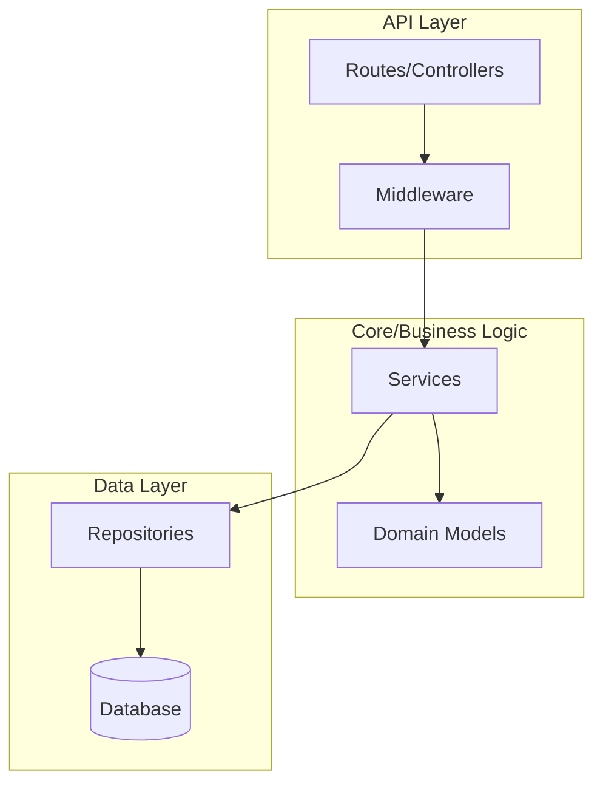
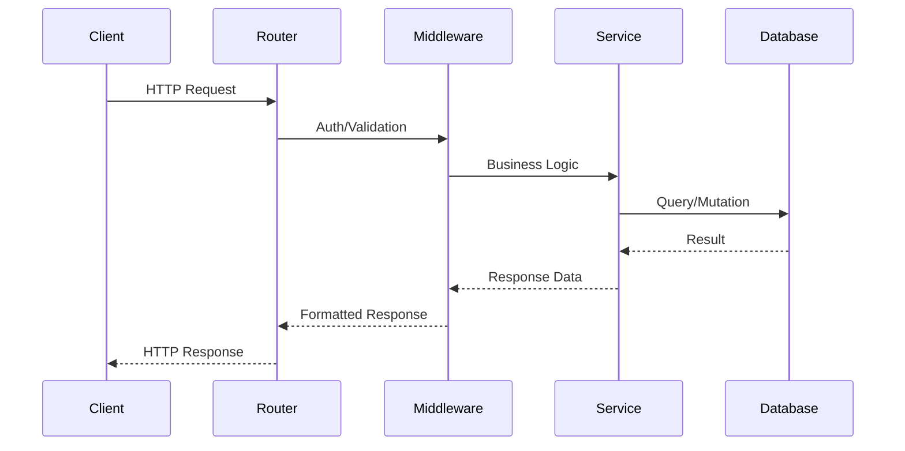
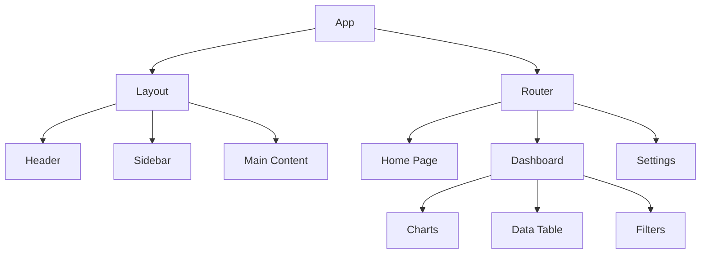
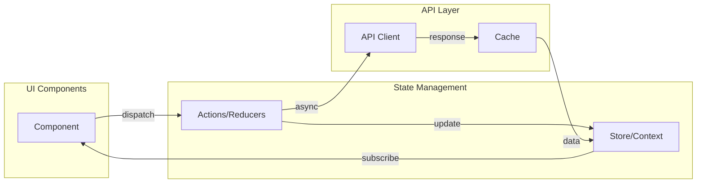
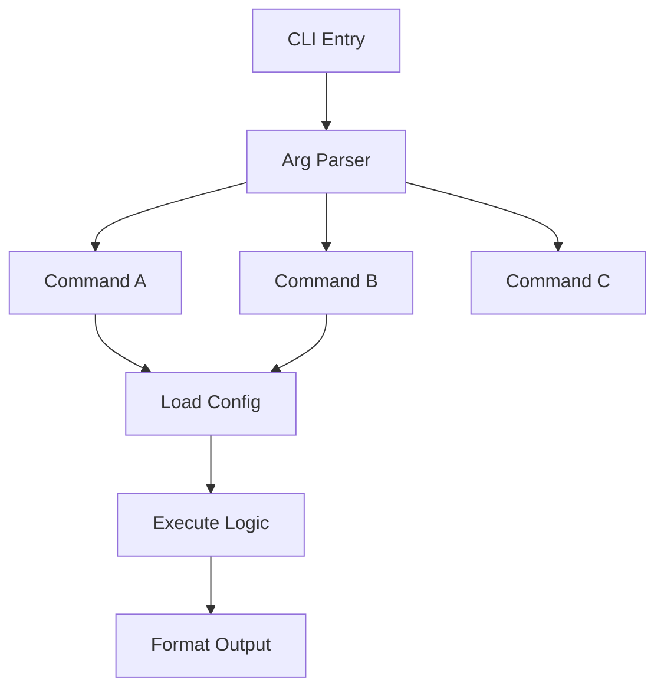
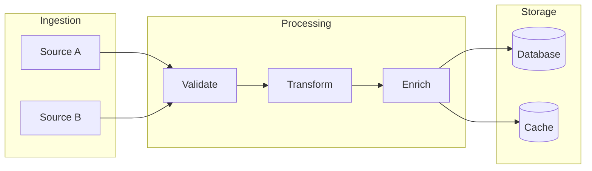
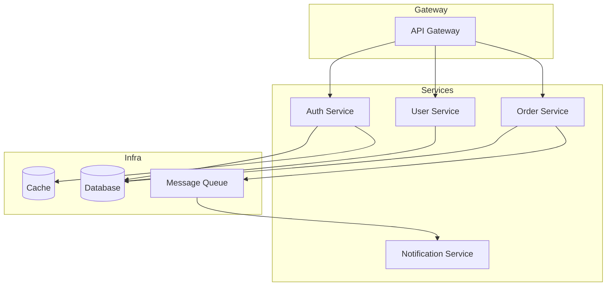
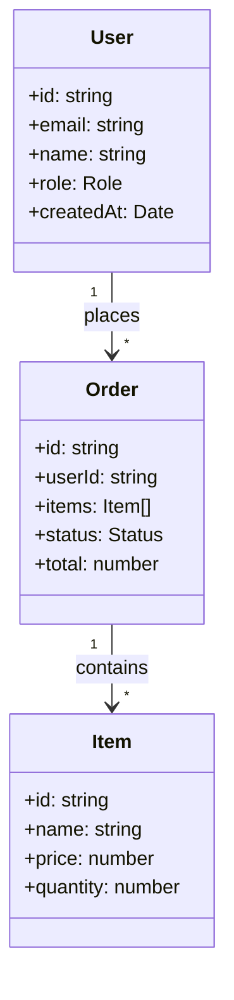
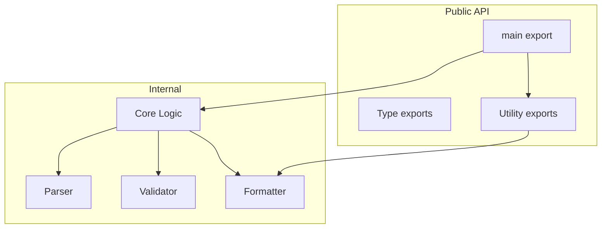

# Mermaid Diagram Patterns

Reusable templates for generating architecture diagrams. Adapt based on project type.

## Module Dependency Graph (Most Common)

Use `graph TD` (top-down) for hierarchical dependencies, `graph LR` (left-right) for pipelines.

## Request Flow Sequence (Web API)

## Component Tree (Frontend)

## State / Data Flow (Frontend)

## CLI Command Flow

## Data Pipeline / ETL

## Service Communication (Microservices / Monorepo)

## Class / Data Model Diagram

## Library Public API Surface

## Tips for Effective Diagrams

1. **One concept per diagram** — avoid cramming everything into one graph
2. **Use subgraph for grouping** — makes layers visually clear
3. **15-20 nodes max** — beyond that, split into multiple diagrams
4. **Short labels** — use `Auth` not `AuthenticationService`, add detail in accompanying text
5. **Arrow labels for clarity** — `-->|"HTTP"|` when the relationship type matters
6. **Choose diagram type wisely:**
   - `graph TD/LR` — dependencies, architecture overview
   - `sequenceDiagram` — request flows, interactions over time
   - `classDiagram` — data models, entity relationships
   - `flowchart` — decision trees, command flows
   - `stateDiagram-v2` — state machines, lifecycle
7. **Color with style** — `style NodeA fill:#f9f,stroke:#333` for emphasis (use sparingly)
